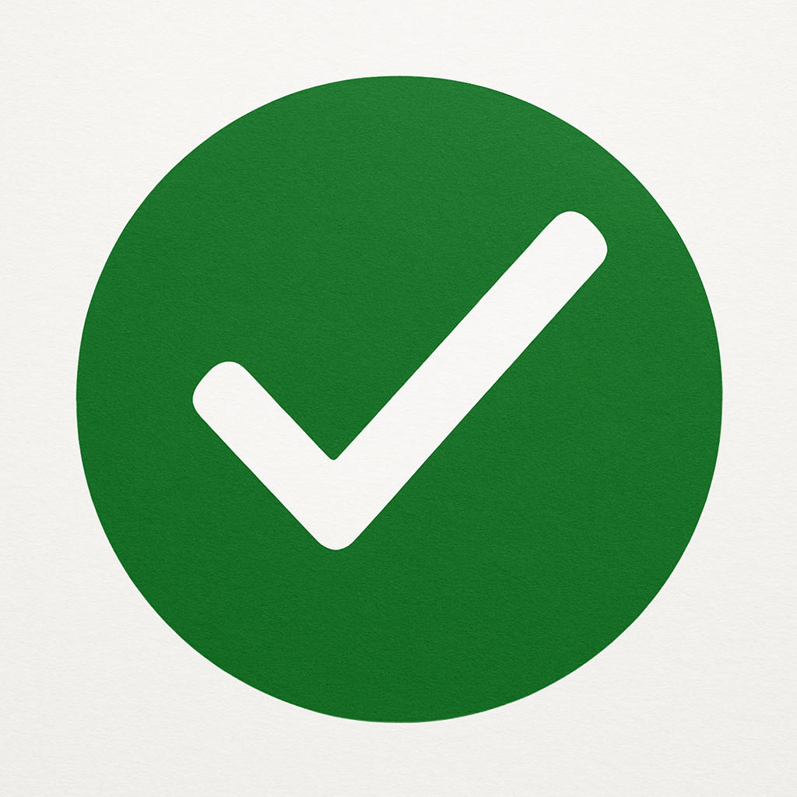

  

<h1 align="center">IMRead</h1>

Jailbreak tweak to mark messages as read automatically after clearing their notifications

Compatible with [BadgeSync](https://github.com/waresnew/badgesync) (though not required)

Note: Marking a message as read will mark all older messages in that conversation read as well.

Special thanks to waresnew's BadgeSync for inspiration and itsjunetime's [smserver](https://github.com/itsjunetime/smserver), which includes very helpful documentation on IMCore

At the moment, this only supports iOS 16+ until someone helps me test on iOS 14/15.
